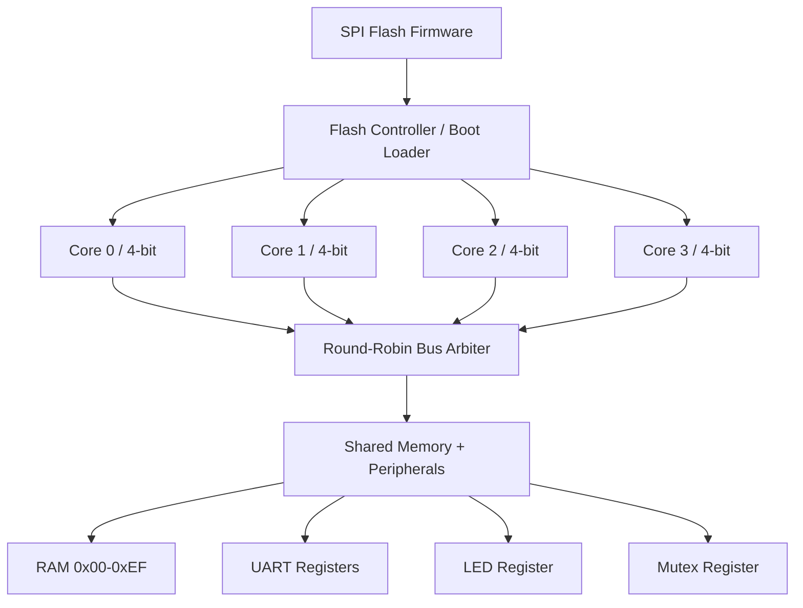
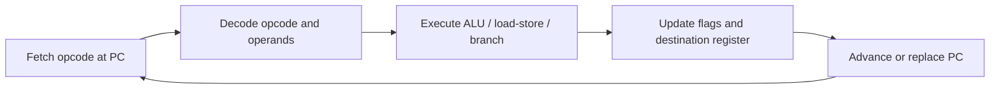

# nibble4 CPU: Assembly Language Guide

A 4-core, 4-bit CPU with UART, SPI Flash, and LED peripherals.

## Architecture Overview



## Instruction Execution Flow



## Register Set

Each core has 4 general-purpose registers and 2 flags:

| Register | Width | Description |
|----------|-------|-------------|
| R0 | 4-bit | General purpose (also accumulator) |
| R1 | 4-bit | General purpose (also address low) |
| R2 | 4-bit | General purpose (also address high) |
| R3 | 4-bit | General purpose (also counter) |
| PC | 8-bit | Program counter |
| Z | 1-bit | Zero flag (set when result = 0) |
| C | 1-bit | Carry flag (set on arithmetic overflow) |

## Instruction Set

8-bit instruction word: `[opcode:4][reg_a:2][reg_b:2]`

Some instructions have a second byte (immediate or address).

### Data Movement

| Opcode | Mnemonic | Encoding | Cycles | Description |
|--------|----------|----------|--------|-------------|
| 0x1 | `LDI Rn, imm` | `0001_aa_00 iiii_iiii` | 3 | Load 4-bit immediate into Rn |
| 0x2 | `LD Rn, [Ra,Rb]` | `0010_aa_bb` | 3 | Load from memory address {Ra,Rb} |
| 0x3 | `ST Rn, [Ra,Rb]` | `0011_aa_bb` | 3 | Store Ra to memory address {Ra,Rb} |

### Arithmetic & Logic

| Opcode | Mnemonic | Encoding | Cycles | Description |
|--------|----------|----------|--------|-------------|
| 0x4 | `ADD Rd, Rs` | `0100_dd_ss` | 2 | Rd = Rd + Rs, sets Z and C |
| 0x5 | `SUB Rd, Rs` | `0101_dd_ss` | 2 | Rd = Rd - Rs, sets Z and C |
| 0x6 | `AND Rd, Rs` | `0110_dd_ss` | 2 | Rd = Rd & Rs, sets Z |
| 0x7 | `OR  Rd, Rs` | `0111_dd_ss` | 2 | Rd = Rd | Rs, sets Z |
| 0x8 | `XOR Rd, Rs` | `1000_dd_ss` | 2 | Rd = Rd ^ Rs, sets Z |
| 0x9 | `NOT Rn` | `1001_nn_00` | 2 | Rn = ~Rn, sets Z |
| 0xA | `SHL Rn` | `1010_nn_00` | 2 | Rn = Rn << 1, C = old MSB |
| 0xB | `SHR Rn` | `1011_nn_00` | 2 | Rn = Rn >> 1, C = old LSB |

### Control Flow

| Opcode | Mnemonic | Encoding | Cycles | Description |
|--------|----------|----------|--------|-------------|
| 0x0 | `NOP` | `0000_0000` | 1 | No operation |
| 0xC | `JMP addr` | `1100_0000 aaaa_aaaa` | 2 | Jump to 8-bit address |
| 0xD | `JZ  addr` | `1101_0000 aaaa_aaaa` | 2 | Jump if Z flag set |
| 0xE | `OUT Rn, Rm` | `1110_nn_mm` | 3 | Write Rn to peripheral 0xF0+Rm |
| 0xF | `HLT` | `1111_0000` | 1 | Halt core (until reset) |

## Memory Map

```
Address Range | Size  | Description
--------------+-------+---------------------------
0x00 - 0xEF   | 240   | Shared RAM (nibbles)
0xF0           |   1   | UART TX data register
0xF1           |   1   | UART TX status (bit 0=busy)
0xF2           |   1   | LED output register
0xF3           |   1   | Core ID (read-only, 0-3)
0xF4           |   1   | Mutex (read=test-and-set, write=release)
0xF5           |   1   | Timer low nibble
0xF6           |   1   | Timer high nibble
0xF8           |   1   | Flash command register
0xF9           |   1   | Flash status (bit 0=busy)
0xFF           |   1   | Boot status (bit 0=done)
```

## Multi-Core Execution

All 4 cores start executing from address 0x00 simultaneously after
the flash bootloader finishes loading firmware into RAM. Each core
has its own PC, registers, and flags, but they share all memory
and peripherals.

### Thread Identification

Each core reads its unique ID from address 0xF3:

```asm
LDI R1, 0x3       ; addr low nibble = 0x3
LDI R2, 0xF       ; addr high nibble = 0xF
LD  R0, [R2, R1]  ; R0 = core ID (0, 1, 2, or 3)
```

### Mutex (Mutual Exclusion)

Address 0xF4 implements atomic test-and-set:

```asm
; Acquire lock
try_lock:
    LDI R1, 0x4
    LDI R2, 0xF
    LD  R0, [R2, R1]    ; read = test-and-set
    JZ  got_it           ; 0 = we acquired the lock
    JMP try_lock         ; 1 = someone else has it, spin

got_it:
    ; ... critical section (use UART, update LEDs, etc.) ...

    ; Release lock
    LDI R0, 0x0
    ST  R0, [R2, R1]    ; write 0 = release
```

### Multi-Core Patterns

**Core-specific work**: Branch based on core ID:
```asm
LD  R0, [R2, R1]    ; R0 = core ID
LDI R1, 0x1
SUB R0, R1
JZ  core1_work       ; if core ID was 1
; ... default (core 0) work
```

**Producer-consumer**: Core 0 writes data, Cores 1-3 read:
```asm
; Core 0: write result to shared address 0x80
LDI R2, 0x8
LDI R1, 0x0
ST  R0, [R2, R1]     ; store to 0x80

; Cores 1-3: poll shared address
poll:
    LD  R0, [R2, R1]  ; read from 0x80
    JZ  poll           ; wait until non-zero
```

## UART Communication

The UART operates at 115200 baud, 8N1. Sending a byte requires
writing two nibbles (low first, then high):

```asm
; Send ASCII 'H' (0x48)
LDI R0, 0x8          ; low nibble
LDI R1, 0x0          ; UART addr = 0xF0
OUT R0, R1            ; write low nibble

LDI R0, 0x4          ; high nibble
OUT R0, R1            ; write high nibble -> triggers TX

; Wait for TX to complete
wait:
    LDI R1, 0x1      ; UART status addr = 0xF1
    LDI R2, 0xF
    LD  R0, [R2, R1]
    JZ  done
    JMP wait
done:
```

## Firmware Flashing

### Method 1: SPI Flash (persistent, survives power cycle)

The bootloader reads firmware from SPI flash address 0x000000 at startup.

1. Assemble your program to a binary (nibble stream)
2. Write to flash using openFPGALoader:

```bash
# Convert assembly to hex
python3 cpu/tools/assembler.py programs/blink.asm -o firmware.bin

# Flash to SPI (Tang Nano 9K)
openFPGALoader -b tangnano9k --external-flash firmware.bin
```

### Method 2: RAM initialization (for simulation/testing)

In Verilog testbench, write directly to RAM:

```verilog
initial begin
    force uut.boot_done = 1;
    uut.u_mem.ram[0] = 4'h1;  // LDI opcode high
    uut.u_mem.ram[1] = 4'h0;  // LDI R0
    uut.u_mem.ram[2] = 4'hF;  // immediate = 0xF
    // ...
end
```

### Method 3: $readmemh (for synthesis with embedded firmware)

Create a hex file and use Verilog `$readmemh`:

```verilog
initial $readmemh("firmware.hex", u_mem.ram);
```

## Simulation

```bash
cd cpu/rtl

# Compile
iverilog -g2012 -o tb_soc \
    nibble4_core.v nibble4_arbiter.v nibble4_memory.v \
    nibble4_uart_tx.v nibble4_flash.v nibble4_soc.v \
    tb_nibble4_soc.v

# Run
vvp tb_soc

# View waveforms
gtkwave nibble4.vcd
```

## Synthesis (Tang Nano 9K)

```bash
# Using Yosys + apicula
yosys -p "
    read_verilog cpu/rtl/nibble4_core.v;
    read_verilog cpu/rtl/nibble4_arbiter.v;
    read_verilog cpu/rtl/nibble4_memory.v;
    read_verilog cpu/rtl/nibble4_uart_tx.v;
    read_verilog cpu/rtl/nibble4_flash.v;
    read_verilog cpu/rtl/nibble4_soc.v;
    synth_gowin -top nibble4_soc -json cpu_build/soc.json
"

nextpnr-gowin \
    --json cpu_build/soc.json \
    --write cpu_build/soc_pnr.json \
    --device GW1NR-LV9QN88PC6/I5 \
    --cst cpu/constraints/tang_nano_9k.cst

gowin_pack -d GW1N-9C -o cpu_build/soc.fs cpu_build/soc_pnr.json
openFPGALoader -b tangnano9k cpu_build/soc.fs
```

## Example Programs

### blink.asm
Toggles all LEDs on/off with a delay loop. Runs on Core 0.

### multicore_uart.asm
All 4 cores send their ID ('A','B','C','D') over UART, coordinated
by the hardware mutex. Demonstrates multi-threaded execution with
shared resource protection.
