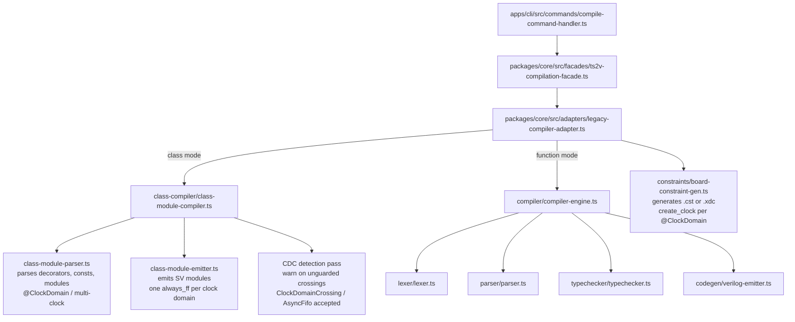
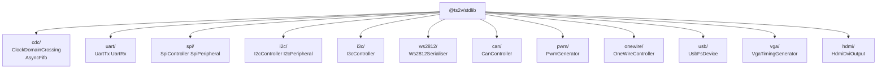
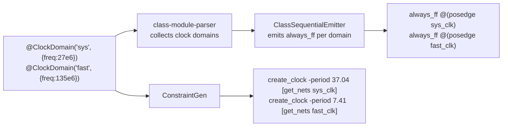
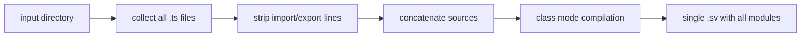
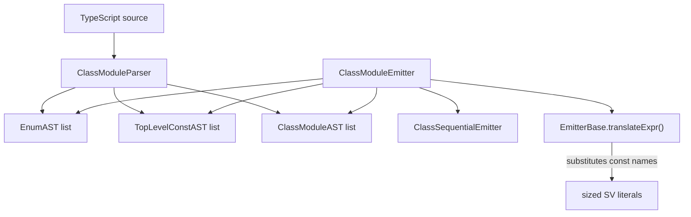
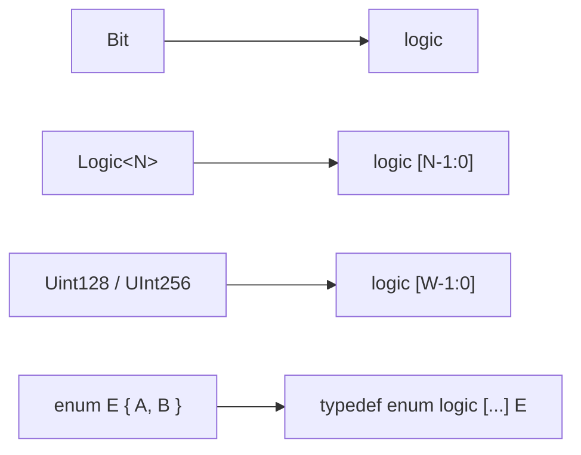
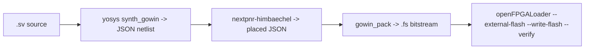

# ts2v Architecture

## Monorepo Layout

```
apps/
  cli/                        - CLI entry point and argument parsing
packages/
  core/                       - Compiler facade, class compiler, legacy compiler
  runtime/                    - TypeScript decorators and hardware type definitions
  stdlib/                     - Reusable hardware IP: UART, SPI, I2C, I3C, WS2812,
  |                             CAN, PWM, 1-Wire, VGA, HDMI, CDC, async FIFO, USB FS
  toolchain/                  - Synthesis and flash adapters (Yosys, nextpnr, openFPGALoader)
  config/                     - Workspace and board configuration services
  process/                    - Process execution abstraction
  types/                      - Shared interfaces and contracts
boards/                       - Board definition JSON files
examples/
  hardware/<board>/<name>/    - Hardware examples (TypeScript source only)
  cpu/nibble4/                - nibble4 4-bit CPU + bootloader + assembler + programs
  <name>/                     - Simulation examples
testbenches/                  - TypeScript UVM-style testbench specs (SeqTestSpec / CombTestSpec)
tests/                        - Root regression test suite
```

## Compilation Pipeline

Two compilation modes are supported. Class mode is the primary path for all
hardware examples. Function mode handles legacy single-function designs.



## @ts2v/stdlib Package

The stdlib provides synthesisable hardware IP as TypeScript classes that compile
to clean SystemVerilog through the ts2v class compiler.



## Multi-Clock Domain Support

`@ClockDomain` registers named clock domains on a module. The compiler emits
one `always_ff` block per domain and wires named clock ports automatically.
CDC crossings are detected: `ClockDomainCrossing<Logic>` (two-FF sync) and
`AsyncFifo<T, Depth>` (gray-code dual-clock FIFO) are the approved primitives.



## Multi-File Directory Compilation

When the input path is a directory, `LegacyCompilerAdapter` collects all
`.ts` files, strips import statements (they are TypeScript-only hints, not
synthesized), concatenates all sources into one string, and passes the result
to class mode compilation. This is how multi-module designs like
`examples/hardware/tang_nano_20k/ws2812_demo/` are compiled.



## Class Compiler Internals



### Key source files under `packages/core/src/compiler/class-compiler/`

| File                          | Responsibility                                            |
| ----------------------------- | --------------------------------------------------------- |
| `class-module-ast.ts`         | AST node types: EnumAST, ClassModuleAST, TopLevelConstAST |
| `class-module-parser-base.ts` | Token navigation helpers                                  |
| `class-module-parser.ts`      | Parses decorators, classes, enums, top-level consts       |
| `class-stmt-parser.ts`        | Parses statement bodies (if/else, switch, assignments)    |
| `class-decl-parser.ts`        | Parses field declarations and decorators                  |
| `class-module-emitter.ts`     | Emits SV module headers, port lists, submodule instances  |
| `class-sequential-emitter.ts` | Emits always_ff blocks                                    |
| `class-emitter-base.ts`       | Expression translation (hex sizing, const substitution)   |
| `class-sv-helpers.ts`         | SV literal helpers (sizeLiteral, sanitize)                |
| `class-module-compiler.ts`    | Top-level entry: parser -> emitter                        |

## Type Mapping



## Board Constraint Generation

`BoardConstraintGen` reads a board JSON definition and emits vendor-specific
constraints. Gowin FPGAs get `.cst` files with `IO_LOC` and `IO_PORT`
directives. Xilinx FPGAs get `.xdc` files.

## Toolchain Flow (Gowin boards)



All synthesis runs inside the `ts2v-gowin-oss` container image built from
`toolchain/Dockerfile`. No host installation of Yosys or nextpnr is required.

## Error Handling

All compiler errors carry a source location and a prefix code.

| Prefix    | Origin         |
| --------- | -------------- |
| TS2V-1000 | Lexer          |
| TS2V-2000 | Parser         |
| TS2V-3000 | Type checker   |
| TS2V-4000 | Code generator |

