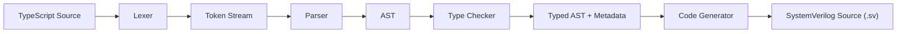
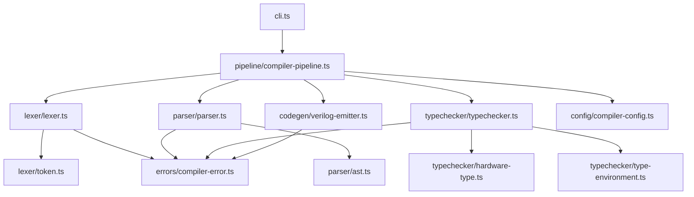
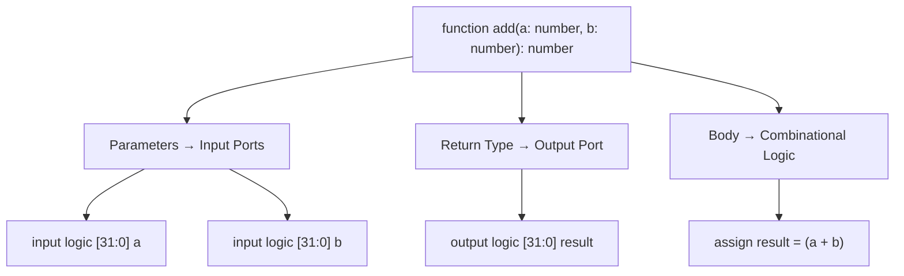
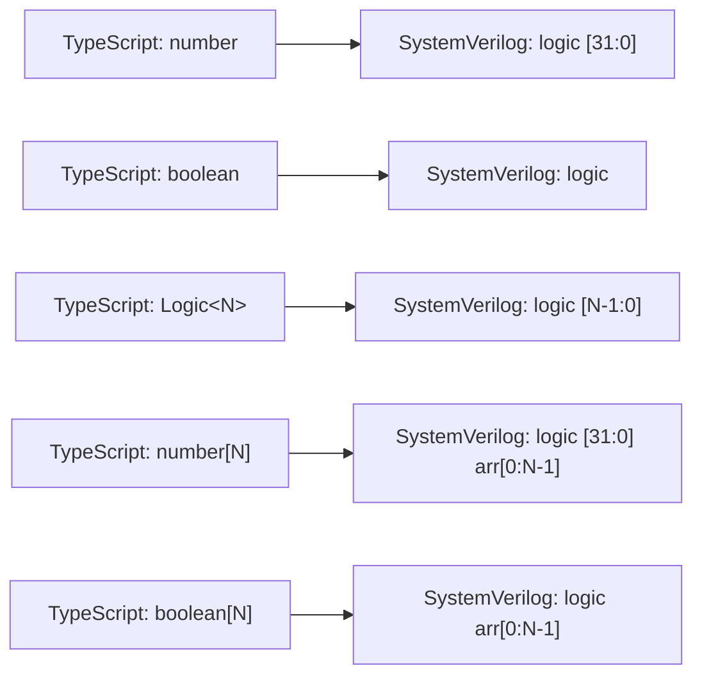
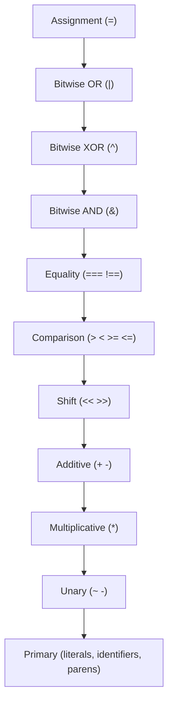
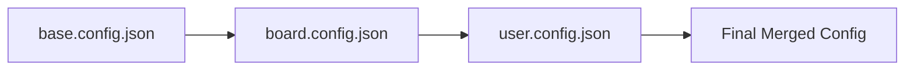
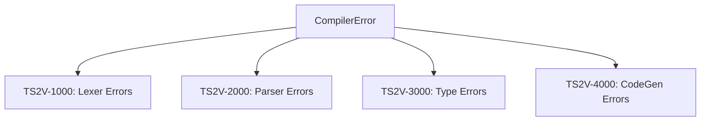

# ts2v Architecture

## Pipeline Overview

The transpiler follows a classic 4-stage compiler pipeline.
Each stage has a single responsibility and produces a well-defined artifact.



## Module Structure



## Translation Flow: TypeScript Function to SystemVerilog Module



## Type Mapping



## Operator Precedence (Parsing)

The parser uses precedence climbing with these levels (lowest to highest):



## Config Overlay System

Configs merge in layers. Each layer overrides values from the previous.



## Error Handling Strategy

All errors carry a source location and an error code prefix.



## File Layout

```
ts2v/
  src/
    constants/         Numeric, string, keyword constants
    errors/            CompilerError with source location
    lexer/             Tokenizer (token.ts, lexer.ts)
    parser/            AST definitions and recursive descent parser
    typechecker/       Type resolution and validation
    codegen/           Verilog source emission
    pipeline/          Orchestrates all stages
    config/            Layered config with merge support
    cli.ts             Command-line entry point
    index.ts           Public API barrel export
  tests/               Unit and integration tests
  examples/            Sample TypeScript hardware descriptions
  configs/             Base and board config files
  docs/                Architecture and specification documents
```
