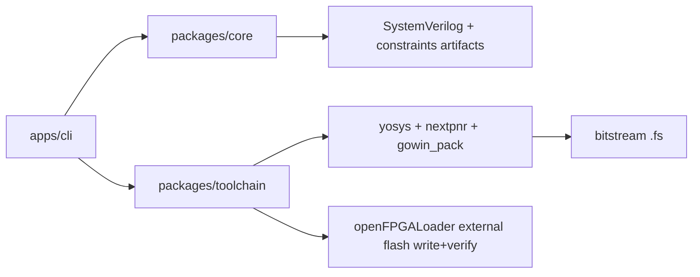

# Development Guide

This guide is for contributors working on the compiler, board support, and hardware flow.

## First Principles
- Treat generated hardware as real hardware, not software runtime behavior.
- Keep board-specific behavior in adapters and board definition JSON, not scattered in compiler code.
- Validate with real compile/flash flows, not unit tests alone.

## Architecture Overview


## Prerequisites
- Linux
- Bun 1.3+
- Podman or Docker
- USB access to FPGA programmer

## Standard Dev Loop
1. Install dependencies:
```bash
bun install
```
2. Build toolchain image:
```bash
bun run toolchain:image:build
```
3. Run full quality gate:
```bash
bun run quality
```
4. Run containerized UVM-style simulation smoke test:
```bash
bun run test:uvm
```
5. Compile and flash known-good example:
```bash
bun run apps/cli/src/index.ts compile examples/hardware/tang_nano_20k_blinker.ts \
  --board boards/tang_nano_20k.board.json \
  --out .artifacts/tang20k \
  --flash
```

## Mandatory Hardware Validation
For changes affecting toolchain, board definitions, or flashing:
- verify `openFPGALoader --scan-usb` from container,
- verify flash output includes `--external-flash --write-flash --verify`,
- verify power-cycle persistence.

## Board Definition Work
Use this guide:
- `docs/guides/board-definition-authoring.md`

## Debugging Failures
Use this guide:
- `docs/guides/debugging-and-troubleshooting.md`

## Design Notes For Tang Nano 20K
- LEDs are active-low (`0` on, `1` off).
- Persistent programming should use external flash mode.
- Start bring-up with minimal one-output designs before complex buses/peripherals.

## Example Progression
1. `examples/hardware/tang_nano_20k_led0_solid_on.ts`
2. `examples/hardware/tang_nano_20k_blinker.ts`
3. `examples/hardware/tang_nano_20k_ws2812b.ts`

## Production Acceptance Checklist
- `bun run quality` passes.
- compile artifacts generated (`.sv`, constraints, `.fs`).
- flash logs show write + verify completion.
- expected board behavior survives power cycle.
