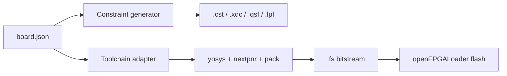

# Board Definition Authoring Guide

This guide explains exactly how board definition JSON files work, what is required, what is optional, and how to safely add new board definitions for production use.

## Why Board Definitions Matter
A board definition drives three critical things:
- pin constraints generation,
- synthesis/place-and-route target device settings,
- programming profile behavior.

If the board definition is wrong, compile can succeed but hardware appears dead.

## Data Flow


## File Location
Put board files under:
- `boards/*.board.json`

Example:
- `boards/tang_nano_20k.board.json`

## Minimum Required Fields
At minimum you need:
- `vendor`
- `family`
- `part`
- at least one clock or IO pin mapping used by your top module

Minimal working Tang Nano 20K style example:
```json
{
  "vendor": "gowin",
  "family": "GW2A-18C",
  "part": "GW2AR-LV18QN88C8/I7",
  "clocks": {
    "clk": { "pin": "4", "freq": "27MHz", "std": "LVCMOS33" }
  },
  "io": {
    "led": { "pin": "15", "std": "LVCMOS33" }
  }
}
```

## Field Reference

### `vendor`
Controls constraint format and toolchain assumptions.

Typical values:
- `gowin`
- `xilinx`
- `intel`
- `lattice`

### `family`
Human/flow descriptor used by synthesis path and docs.

### `part`
Exact FPGA part number passed to place-and-route flow.

### `clocks`
Named clock inputs with pin and IO standard.

Example:
```json
"clocks": {
  "clk": { "pin": "4", "freq": "27MHz", "std": "LVCMOS33" }
}
```

### `io`
Named functional IOs used by your generated module top ports.

Example:
```json
"io": {
  "rst_n": { "pin": "88", "std": "LVCMOS33", "pull": "UP" },
  "led[0]": { "pin": "15", "std": "LVCMOS33" },
  "ws2812": { "pin": "73", "std": "LVCMOS33", "drive": "8" }
}
```

## Critical Naming Rule
Constraint names must match module port names.

Example mismatch that causes dead hardware:
- module output is `led`
- board definition maps only `led[0]`

This can compile but fail routing or leave outputs unconstrained.

Use one of these strategies:
- If module has scalar output: map scalar name (`led`).
- If module has bus output: map bus bits (`led[0]`, `led[1]`, ...).

## Adding A New Board Definition
1. Copy an existing board file.
2. Update `vendor`, `family`, `part`.
3. Add clock mapping first.
4. Add only the IO signals you actually need for first bring-up.
5. Compile a minimal one-output design.
6. Flash and verify physical behavior.
7. Expand IO map gradually.

## Recommended Bring-Up Design For New Boards
Use a minimal scalar LED output first to eliminate bus naming errors.

## Validation Checklist
- `bun run quality` passes.
- compile artifacts generated.
- constraints file contains expected IO names.
- toolchain logs show correct target part.
- flash logs show `--external-flash --write-flash --verify` (for Tang Nano 20K flow).
- post-power-cycle behavior persists.

## Common Failure Modes

### 1. No visible behavior after successful flash
Likely causes:
- wrong pin mapping,
- wrong board family/part,
- wrong output polarity assumptions (active-low LEDs),
- wrong module port naming vs board IO naming.

### 2. Unconstrained IO errors
Typical reason:
- top module has ports not present in board definition.

### 3. IO conflict across reused pins
Do not map two logical signals to the same physical pin unless intentionally multiplexed and validated.

## Additional Resources
- openFPGALoader docs: https://github.com/trabucayre/openFPGALoader
- Yosys: https://yosyshq.net/yosys/
- nextpnr: https://github.com/YosysHQ/nextpnr
- Apicula/gowin_pack: https://github.com/YosysHQ/apicula
- Tang Nano 20K LED reference workflow: https://wiki.sipeed.com/hardware/en/tang/tang-nano-20k/example/led.html
