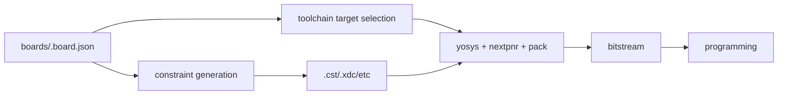

# Board Definition Authoring Guide

This guide explains board JSON files in plain operational terms: where each value comes from, how to extract it from schematics, and how to verify that the mapping is actually correct on hardware.

## What A Board Definition Controls
`boards/*.board.json` controls:
- pin-to-port mapping in generated constraints,
- target FPGA part/family selection for synthesis and PNR,
- practical hardware behavior after flash.

If this file is wrong, builds can still succeed while hardware appears dead.

## Data Path


## The Exact File Shape
Minimal structure:
```json
{
  "vendor": "gowin",
  "family": "GW2A-18C",
  "part": "GW2AR-LV18QN88C8/I7",
  "clocks": {
    "clk": { "pin": "4", "freq": "27MHz", "std": "LVCMOS33" }
  },
  "io": {
    "led": { "pin": "15", "std": "LVCMOS33" }
  }
}
```

Required keys:
- `vendor`
- `family`
- `part`
- `clocks` and/or `io` entries that match your module ports

## How To Read A Schematic And Map It Correctly
Use this 1:1 mapping rule:
- schematic label on FPGA side -> `pin`
- signal electrical standard -> `std`
- external pull requirements -> `pull`
- drive strength requirements -> `drive`

Example workflow:
1. Open official board schematic PDF for your board revision.
2. Find the net label that connects to your intended FPGA signal.
3. Confirm the physical FPGA pin number, not only connector silk text.
4. Add or update JSON entry under `clocks` or `io`.
5. Regenerate and inspect constraints.
6. Run hardware bring-up with a minimal test design.

## Tang Nano 20K Reference Mapping (Current Workspace)
Based on workspace board definition and schematic-backed updates:

| Logical name | Purpose | Pin | Notes |
| --- | --- | --- | --- |
| `clk` | onboard clock | `4` | 27 MHz |
| `rst_n` | reset button/input | `88` | active low with pull-up |
| `btn` | user button | `87` | pull-up |
| `led[0..5]` | user LEDs | `15..20` | active-low behavior in examples |
| `ws2812` | onboard RGB/WS2812 data | `79` | schematic net `PIN79_WS2812` |

If your board revision differs, fork the board JSON by revision and do not silently reuse the wrong mapping.

## Port Naming Rule (Most Common Failure)
Board JSON keys must match generated top module ports exactly.

Examples:
- top port `ws2812` -> board entry must be `"ws2812": { ... }`
- top bus `led[5:0]` -> board entries must use indexed names (`led[0]`, `led[1]`, ...)

Bad mapping example:
- top port is scalar `led`
- board defines only `led[0]`

Result: constraints mismatch and non-obvious hardware failure.

## Known Pin-Reuse Trap
In this workspace, some sample UART mappings and LED mappings share pins for convenience in limited demos.
Do not assume those can be used simultaneously in one design unless you intentionally multiplex and validate the hardware wiring.

## Step-By-Step: Add Or Fix A Board Definition
1. Copy nearest existing board file in `boards/`.
2. Set `vendor`, `family`, `part` from datasheet/schematic.
3. Add `clk` first and verify compile.
4. Add one visible output (`led` or heartbeat output).
5. Flash and power-cycle check.
6. Add peripheral pins (`uart`, `ws2812`, etc.) one at a time.
7. Update docs with exact schematic source and revision.

## Validation Commands
```bash
bun run quality
bun run apps/cli/src/index.ts compile examples/hardware/tang_nano_20k_blinker.ts --board boards/tang_nano_20k.board.json --out .artifacts/tang20k --flash
bun run apps/cli/src/index.ts compile examples/hardware/tang_nano_20k_ws2812b.ts --board boards/tang_nano_20k.board.json --out .artifacts/ws2812 --flash
```

Expected flash proof lines:
- `--external-flash --write-flash --verify`
- `write to flash`
- `DONE`

## Quick Debug Checklist
If flash succeeds but output is wrong:
- pin number mismatch vs schematic,
- wrong port name in JSON,
- active-low LED polarity confusion,
- shared-pin conflict,
- missing shared ground for external peripherals.

## References
- Sipeed Tang Nano 20K schematic directory: https://dl.sipeed.com/shareURL/TANG/Nano_20K/2_Schematic
- openFPGALoader: https://github.com/trabucayre/openFPGALoader
- Yosys: https://yosyshq.net/yosys/
- nextpnr: https://github.com/YosysHQ/nextpnr
- Apicula/gowin_pack: https://github.com/YosysHQ/apicula
