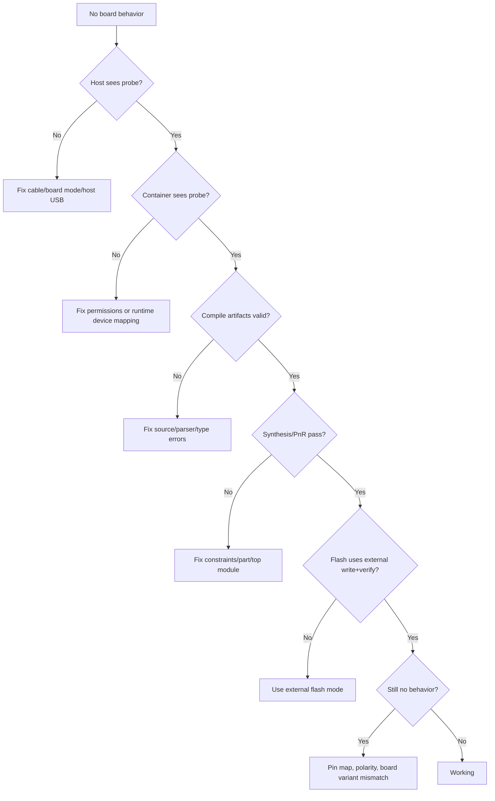

# Debugging And Troubleshooting Guide

This guide is the practical runbook for when hardware does not behave as expected.

## Debug Philosophy
Always isolate one layer at a time:
1. host USB visibility,
2. container USB visibility,
3. compile artifacts,
4. synthesis/place/pack success,
5. flash persistence,
6. physical IO behavior.

## Layered Diagnostic Flow


## Fast Command Set

### USB Probe Checks
```bash
lsusb
podman run --rm --device /dev/bus/usb ts2v-gowin-oss:latest openFPGALoader --scan-usb
```

### Compile + Flash (Tang Nano 20K)
```bash
bun run apps/cli/src/index.ts compile examples/hardware/tang_nano_20k_blinker.ts \
  --board boards/tang_nano_20k.board.json \
  --out .artifacts/tang20k \
  --flash
```

### Explicit Manual Flash
```bash
podman run --rm --device /dev/bus/usb -v "$PWD:/workspace" -w /workspace \
  ts2v-gowin-oss:latest \
  openFPGALoader --external-flash --write-flash --verify -r -b tangnano20k \
  /workspace/.artifacts/tang20k/tang_nano_20k_blinker.fs
```

## What Success Looks Like
Programming output should include:
- `write to flash`
- `Detected: Winbond ...`
- `Verifying write (May take time)`
- `DONE`

## Failure Signatures And Fixes

### `unable to open ftdi device ... Access denied`
Cause:
- USB permissions missing for current user/runtime.
Fix:
- apply udev rules and re-login/reload rules,
- verify container can see probe with `--scan-usb`.

### `Unconstrained IO:<name>`
Cause:
- board definition does not map all top module ports.
Fix:
- align module port names and board IO names exactly,
- use minimal board definition for first bring-up.

### Flash succeeds but power-cycle loses behavior
Cause:
- SRAM load mode or wrong boot path.
Fix:
- use explicit `--external-flash --write-flash --verify`.

### Flash succeeds but still no visible LED behavior
Cause candidates:
- wrong pin map,
- active-low inversion not handled,
- wrong board variant/profile,
- design depends on reset/clock assumptions.
Fix:
- flash a minimal always-on LED image,
- test SRAM load mode for immediate behavior,
- verify board definition pins against board schematic.

## Minimal Bring-Up Strategy
Use this order for new or uncertain hardware:
1. Single scalar LED output forced ON.
2. Single scalar LED output blinking.
3. Bus LED patterns.
4. Reset-dependent logic.
5. WS2812 or UART peripherals.

## WS2812-Specific Debug
If bitstream is flashed but strip stays dark:
- check `ws2812` pin mapping,
- check shared ground,
- check strip power rail,
- check signal timing with logic analyzer,
- validate first LED is not damaged.

## Resource Links
- openFPGALoader: https://github.com/trabucayre/openFPGALoader
- Yosys: https://yosyshq.net/yosys/
- nextpnr: https://github.com/YosysHQ/nextpnr
- Apicula/gowin_pack: https://github.com/YosysHQ/apicula
- Sipeed Tang Nano 20K LED workflow: https://wiki.sipeed.com/hardware/en/tang/tang-nano-20k/example/led.html
