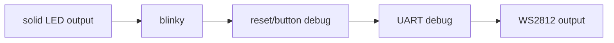

# Examples Matrix

This document maps examples to practical purpose, bring-up stage, and expected hardware behavior.

## Bring-Up Progression

## Recommended Tang Nano 20K Order
1. `examples/hardware/tang_nano_20k_led0_solid_on.ts`
2. `examples/hardware/tang_nano_20k_blinker.ts`
3. `examples/hardware/usb_jtag_probe_blinker.ts`
4. `examples/hardware/tang_nano_20k_reset_debug.ts`
5. `examples/hardware/tang_nano_20k_uart_debug.ts`
6. `examples/hardware/tang_nano_20k_ws2812b.ts`

## Example Intent And Expected Result
- `examples/hardware/tang_nano_20k_led0_solid_on.ts`
	- intent: eliminate reset/clock complexity and prove raw output path.
	- expected: LED0 forced on (active-low board behavior).
- `examples/hardware/tang_nano_20k_blinker.ts`
	- intent: prove sequential logic + clock path.
	- expected: visible periodic LED activity.
- `examples/hardware/usb_jtag_probe_blinker.ts`
	- intent: verify flash/profile loop in parallel with simple LED behavior.
	- expected: same as blinky with explicit probe-focused workflow.
- `examples/hardware/tang_nano_20k_reset_debug.ts`
	- intent: validate reset wiring and polarity assumptions.
	- expected: deterministic reset-state LED signature.
- `examples/hardware/tang_nano_20k_uart_debug.ts`
	- intent: verify serial framing and timing.
	- expected: stable TX activity suitable for logic analyzer.
- `examples/hardware/tang_nano_20k_ws2812b.ts`
	- intent: verify peripheral-style single-wire output.
	- expected: valid WS2812 waveform on mapped pin and visible strip response when connected.

## Validation Status
- Hardware examples are compile-tested in `packages/core/src/facades/hardware-examples-compile.test.ts`.
- Flash path is persistent by default: `--external-flash --write-flash --verify`.
- Active-low LED behavior is accounted for in Tang Nano 20K examples.

## Non-Hardware Language Examples
The following examples are useful for parser/type/codegen checks but are not complete hardware bring-up proofs by themselves:
- `examples/adder.ts`
- `examples/alu.ts`
- `examples/blinker.ts`
- `examples/comparator.ts`
- `examples/i2c.ts`
- `examples/mux.ts`
- `examples/pwm.ts`
- `examples/stdlib.ts`
- `examples/uart_tx.ts`
- `examples/ws2812.ts`
