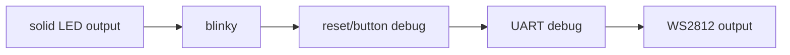

# Examples Matrix

This document maps examples to practical purpose, bring-up stage, and expected hardware behavior.

## Bring-Up Progression


## Recommended Tang Nano 20K Order
1. `examples/hardware/tang_nano_20k_led0_solid_on.ts`
2. `examples/hardware/tang_nano_20k_led_solid_on.ts`
3. `examples/hardware/tang_nano_20k_blinker.ts`
4. `examples/hardware/usb_jtag_probe_blinker.ts`
5. `examples/hardware/tang_nano_20k_reset_debug.ts`
6. `examples/hardware/tang_nano_20k_uart_debug.ts`
7. `examples/hardware/tang_nano_20k_ws2812b.ts`

## Example Intent And Expected Result
- `examples/hardware/tang_nano_20k_led0_solid_on.ts`
	- intent: eliminate reset/clock complexity and prove raw output path.
	- expected: LED0 forced on (active-low board behavior).
- `examples/hardware/tang_nano_20k_led_solid_on.ts`
	- intent: drive full LED bus for immediate visual bring-up.
	- expected: all six active-low LEDs remain on.
- `examples/hardware/tang_nano_20k_blinker.ts`
	- intent: refreshed deterministic clock-only blinky (no reset/button dependency).
	- expected: repeating visible LED phase pattern.
- `examples/hardware/usb_jtag_probe_blinker.ts`
	- intent: verify flash/profile loop in parallel with simple LED behavior.
	- expected: same as blinky with explicit probe-focused workflow.
- `examples/hardware/tang_nano_20k_reset_debug.ts`
	- intent: validate reset wiring and polarity assumptions.
	- expected: deterministic reset-state LED signature.
- `examples/hardware/tang_nano_20k_uart_debug.ts`
	- intent: verify serial framing and timing.
	- expected: stable TX activity suitable for logic analyzer.
- `examples/hardware/tang_nano_20k_ws2812b.ts`
	- intent: refreshed timing-based single-pixel WS2812 driver with onboard LED heartbeat.
	- expected: valid WS2812 waveform on mapped pin and visible strip response when connected.

## Validation Status
- Hardware examples are compile-tested in `packages/core/src/facades/hardware-examples-compile.test.ts`.
- Flash path is persistent by default: `--external-flash --write-flash --verify`.
- Active-low LED behavior is accounted for in Tang Nano 20K examples.

## New Protocol and Multi-Clock Examples (v2.0)

| Directory | Module(s) | Purpose |
|-----------|-----------|---------|
| `examples/hardware/tang_nano_20k/uart-echo/` | UartTx, UartRx | UART loopback - echoes received bytes back |
| `examples/hardware/tang_nano_20k/pwm-fade/` | PwmGenerator | LED fade with adjustable PWM duty cycle |
| `examples/hardware/tang_nano_20k/ws2812-stdlib/` | Ws2812Serialiser | WS2812 rainbow via `@ts2v/stdlib` |
| `examples/hardware/tang_nano_20k/spi-loopback/` | SpiController + SpiPeripheral | SPI controller-peripheral loopback on single board |
| `examples/hardware/tang_nano_20k/i2c-scan/` | I2cController | Scans I2C bus addresses 0x08..0x77, shows found address on LEDs |
| `examples/hardware/tang_nano_20k/dual-clock-sync/` | ClockDomainCrossing | Two-FF synchroniser: button signal from 27 MHz to ~105 kHz domain |
| `examples/hardware/tang_nano_20k/dual-clock-fifo/` | AsyncFifo | Async FIFO: writes from fast clock, reads on slow clock, shows on LEDs |
| `examples/hardware/tang_nano_20k/hdmi-colour-bars/` | VgaTimingGenerator + HdmiDviOutput | 640x480 TMDS colour bar pattern (encoding pipeline demo) |
| `examples/hardware/tang_nano_20k/matrix_uart/hw/` | MatrixTop, MatrixEngine, MatrixUartRx, MatrixUartTx | 4x4 8-bit matrix multiply over UART (64-byte in, 32-byte result out) |
| `examples/hardware/tang_nano_20k/tpu_uart/hw/` | TpuTop, TpuEngine, TpuUartRx, TpuUartTx | 4-element dot product, MAC accumulator, ReLU, reset_acc over UART |

All v2.0 examples compile with:
```bash
bun run apps/cli/src/index.ts compile examples/hardware/tang_nano_20k/<name> \
  --board boards/tang_nano_20k.board.json --out .artifacts/<name>
```

## Non-Hardware Language Examples
The following examples are useful for parser/type/codegen checks but are not complete hardware bring-up proofs by themselves:
- `examples/adder.ts`
- `examples/alu.ts`
- `examples/blinker.ts`
- `examples/comparator.ts`
- `examples/i2c.ts`
- `examples/mux.ts`
- `examples/pwm.ts`
- `examples/stdlib.ts`
- `examples/uart_tx.ts`
- `examples/ws2812.ts`
