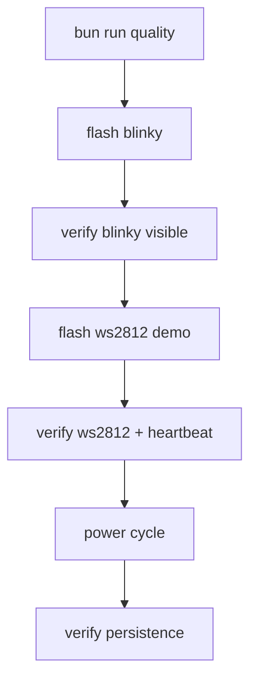

# Production Reality Check

Use this guide to verify the repository is truly production-operational on real hardware.

## Pass/Fail Criteria
A run is production-valid only if all items pass:
- quality gates pass (`bun run quality`),
- blinky compiles and flashes in persistent external flash mode,
- ws2812 demo compiles and flashes in persistent external flash mode,
- expected runtime behavior is visible on board/strip,
- power-cycle retains behavior.

## Validation Workflow


## 1. Quality Gate
```bash
TURBO_UI=false bun run quality
```

## 2. Blinky Compile + Flash
```bash
bun run apps/cli/src/index.ts compile examples/hardware/tang_nano_20k_blinker.ts \
  --board boards/tang_nano_20k.board.json \
  --out .artifacts/tang20k \
  --flash
```

Expected log markers:
- `--external-flash --write-flash --verify`
- `write to flash`
- `Verifying write (May take time)`
- `DONE`

Expected board behavior:
- active-low LED phase pattern is visible.

## 3. WS2812 Demo Compile + Flash
```bash
bun run apps/cli/src/index.ts compile examples/hardware/tang_nano_20k_ws2812b.ts \
  --board boards/tang_nano_20k.board.json \
  --out .artifacts/ws2812 \
  --flash
```

Expected behavior:
- onboard LED heartbeat toggles,
- WS2812 output pin carries color-frame stream,
- attached strip shows color changes.

## 4. Power-Cycle Persistence Check
1. Power board off.
2. Power board on.
3. Confirm flashed behavior is retained.

If persistence fails, inspect:
- flash command mode,
- board boot source configuration,
- programmer profile/permissions.

## 5. Regression Tests For Hardware Examples
```bash
bun test packages/core/src/facades/hardware-examples-compile.test.ts
bun test packages/core/src/facades/hardware-examples-behavior.test.ts
bun test packages/toolchain/src/adapters/tang-nano-20k-toolchain-adapter.test.ts
```

## 6. Required Evidence To Log
Record command and key outputs in `docs/append-only-engineering-log.md`:
- probe scan result,
- flash command line,
- write/verify completion lines,
- observed hardware behavior summary.
