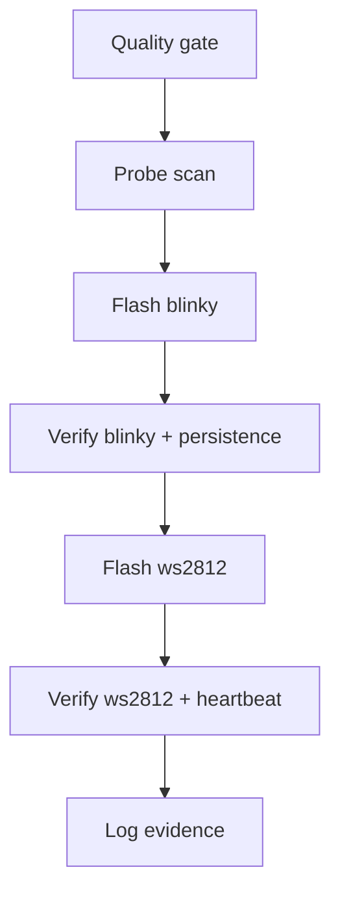

# Production Reality Check

Use this guide to validate real operational readiness, not only compile success.

## Hard Pass Criteria
All must pass:
- `TURBO_UI=false bun run quality` passes,
- persistent flash path is used (`--external-flash --write-flash --verify`),
- blinky behavior is visible,
- WS2812 behavior is visible,
- behavior remains after power cycle,
- evidence is captured in `docs/append-only-engineering-log.md`.

## Validation Workflow


## Real Production Scenarios

### Scenario A: Fresh Board Bring-Up
Goal:
- prove a newly connected board can be flashed and shows deterministic behavior.

Commands:
```bash
podman run --rm --device /dev/bus/usb ts2v-gowin-oss:latest openFPGALoader --scan-usb
bun run apps/cli/src/index.ts compile examples/hardware/tang_nano_20k_blinker.ts --board boards/tang_nano_20k.board.json --out .artifacts/blinky-e2e --flash
```

Pass:
- probe row visible in scan,
- flash output includes `write to flash`, `DONE`, `Verifying write`, `Done`,
- LED pattern is visible.

### Scenario B: Feature Demo Delivery (WS2812)
Goal:
- prove user-visible peripheral output, not only onboard LED.

Commands:
```bash
bun run apps/cli/src/index.ts compile examples/hardware/tang_nano_20k_ws2812b.ts --board boards/tang_nano_20k.board.json --out .artifacts/ws2812-e2e --flash
```

Pass:
- flash output includes `--external-flash --write-flash --verify`,
- output includes `Detected: Winbond W25Q64`,
- output includes `Verifying write (May take time)` and final `Done`,
- heartbeat LED toggles,
- WS2812 strip changes colors.

Critical wiring note:
- in this workspace, `ws2812` maps to Tang Nano 20K `PIN79_WS2812`.

### Scenario C: Release Candidate Gate
Goal:
- prove software quality and hardware path together.

Commands:
```bash
TURBO_UI=false bun run quality
bun test packages/core/src/facades/hardware-examples-compile.test.ts
bun test packages/core/src/facades/hardware-examples-behavior.test.ts
bun test packages/toolchain/src/adapters/tang-nano-20k-toolchain-adapter.test.ts
```

Pass:
- all commands exit `0`,
- no flash-regression markers missing,
- evidence appended to engineering log.

## Evidence Template (Copy To Log)
Use this exact shape in `docs/append-only-engineering-log.md`:
- command line
- probe row seen (`vid:pid`, probe type)
- programmer flags used
- `write to flash`
- `Detected: Winbond ...`
- `Verifying write (May take time)`
- final `Done`/`DONE`
- observed board behavior summary

## Fail-Fast Rules
Stop and fix before continuing if:
- probe scan is empty,
- command does not include `--external-flash --write-flash --verify`,
- constraints do not map WS2812 to expected board pin,
- power-cycle loses behavior.
