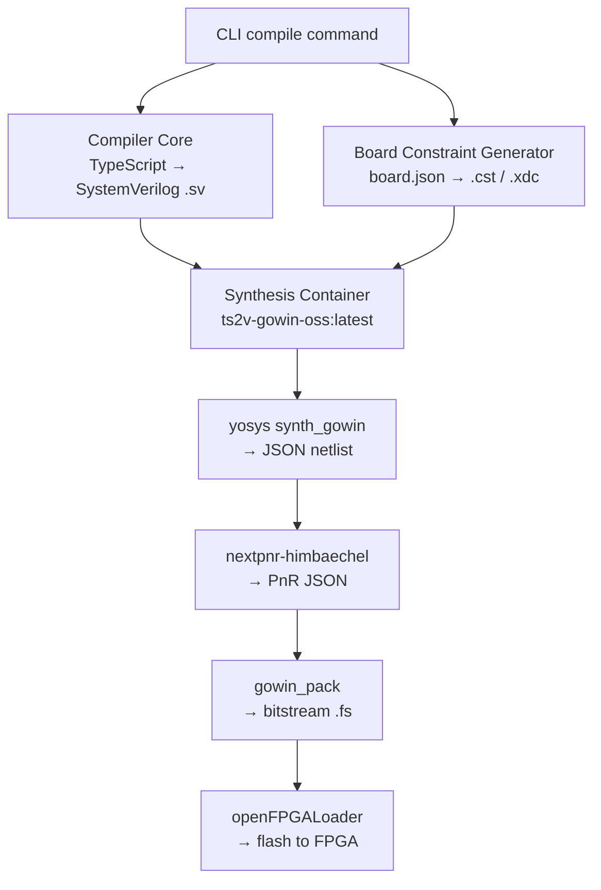

# Hardware Toolchain Guide

## Open-Source-Only Policy

ts2v exclusively targets open-source synthesis and programming tools. No closed-source EDA tools (Vivado, Quartus, Gowin EDA proprietary pack) are required or supported.

Every board in the toolchain must have a verified, reproducible end-to-end path:  
**Yosys synthesis → nextpnr place-and-route → bitstream pack → openFPGALoader programming**

## Fully Supported Boards

| Board         | FPGA      | Synthesis           | PnR                  | Pack         | Flash                                                    |
| ------------- | --------- | ------------------- | -------------------- | ------------ | -------------------------------------------------------- |
| Tang Nano 20K | GW2AR-18C | `yosys synth_gowin` | `nextpnr-himbaechel` | `gowin_pack` | `openFPGALoader --external-flash --write-flash --verify` |
| Tang Nano 9K  | GW1NR-9C  | `yosys synth_gowin` | `nextpnr-himbaechel` | `gowin_pack` | `openFPGALoader --external-flash --write-flash --verify` |

## Boards Out of Scope

| Board     | FPGA      | Reason                                                     |
| --------- | --------- | ---------------------------------------------------------- |
| Arty A7   | XC7A35T   | nextpnr-xilinx requires xraydb from Vivado — not fully OSS |
| DE10-Nano | Cyclone V | Intel Quartus required — no viable OSS synthesis           |

The constraint generator (`board-constraint-gen.ts`) can generate `.xdc` files for Arty A7, but no synthesis flow is provided.

## Toolchain Stages



## Container Runtime

The synthesis/flash flow runs inside a container (Podman preferred, Docker fallback) using the `ts2v-gowin-oss:latest` image which bundles the complete OSS CAD suite.

Build the image (required once before any synthesis or flash step):

```bash
bun run toolchain:image:build
```

Or explicitly with Podman/Docker:

```bash
bun run toolchain:image:build:podman
bun run toolchain:image:build:docker
```

## Compile + Flash (Tang Nano 20K)

The project CLI handles compile → synthesize → flash in a single command. No manual container orchestration is needed.

### Blinker (minimal example)

```bash
bun run apps/cli/src/index.ts compile \
  examples/hardware/tang_nano_20k/blinker/blinker.ts \
  --board boards/tang_nano_20k.board.json \
  --out .artifacts/blinker \
  --flash
```

### WS2812 Interactive Demo (flagship example)

```bash
bun run apps/cli/src/index.ts compile \
  examples/hardware/tang_nano_20k/ws2812_demo/ws2812_demo.ts \
  --board boards/tang_nano_20k.board.json \
  --out .artifacts/ws2812_demo \
  --flash
```

### Confirmed Flash Output (Winbond W25Q64, Tang Nano 20K, 2025)

```
Detected: Winbond W25Q64 128 sectors size: 64Mb
Writing:  [==================================================] 100.00%  Done
Verifying write ... Reading: [==================================================] Done
```

Power cycle the board after flash. The bitstream reloads from external SPI flash automatically.

## Persistent Programming

Flash is written to external SPI flash with `--external-flash --write-flash --verify -r`.
After power cycle, the bitstream reloads automatically from flash.

## USB Probe Validation

Always verify the programmer is detected before attempting a flash:

```bash
# Host-side USB check
lsusb
# Expected: 0403:6010 Future Technology Devices International, Ltd FT2232C/D/H Dual UART/FIFO IC
# (shows as "SIPEED USB Debugger" on some systems)

# Container-side probe scan
podman run --rm --device /dev/bus/usb ts2v-gowin-oss:latest openFPGALoader --scan-usb
```

If the device is not found, check USB permissions and container USB passthrough. See `docs/guides/programmer-profiles-and-usb-permissions.md`.

## Programmer Profiles

Per-board programmer profiles are defined in `configs/workspace.config.json`.
Multiple profiles are tried in order (autodetect first, then explicit cable/VID/PID).

**Verified working profile for Tang Nano 20K:**

| Profile                  | Cable    | VID      | PID      | Notes                             |
| ------------------------ | -------- | -------- | -------- | --------------------------------- |
| `sipeed-ft2232-debugger` | `ft2232` | `0x0403` | `0x6010` | Confirmed flash on Winbond W25Q64 |

**Other profiles present but not required for Tang Nano 20K:**
- `usi-cmsisdap` (cable: cmsisdap, VID: 0x10ab, PID: 0x9309)
- `goodix-cmsisdap-candidate` (VID: 0x27c6, PID: 0x6594)

## Failure Boundaries

| Stage           | Common Failure                                 | Diagnostic                               |
| --------------- | ---------------------------------------------- | ---------------------------------------- |
| Compile         | Parse/type error                               | See error message with line/column       |
| Synthesis       | Wrong top module name / unsupported constructs | yosys stderr                             |
| Place-and-route | Bad constraints / device mismatch              | nextpnr stderr                           |
| Flash           | USB permissions / wrong cable profile          | openFPGALoader scan-usb                  |
| No behavior     | Wrong pin mapping / polarity                   | Check board definition against schematic |

## Deep Dive Guides

- `docs/guides/end-to-end-delivery.md` — step-by-step compile-to-flash workflow
- `docs/guides/board-definition-authoring.md`
- `docs/guides/tang_nano_20k_programming.md`
- `docs/guides/debugging-and-troubleshooting.md`
- `docs/guides/programmer-profiles-and-usb-permissions.md`
- `docs/guides/production-reality-check.md`
