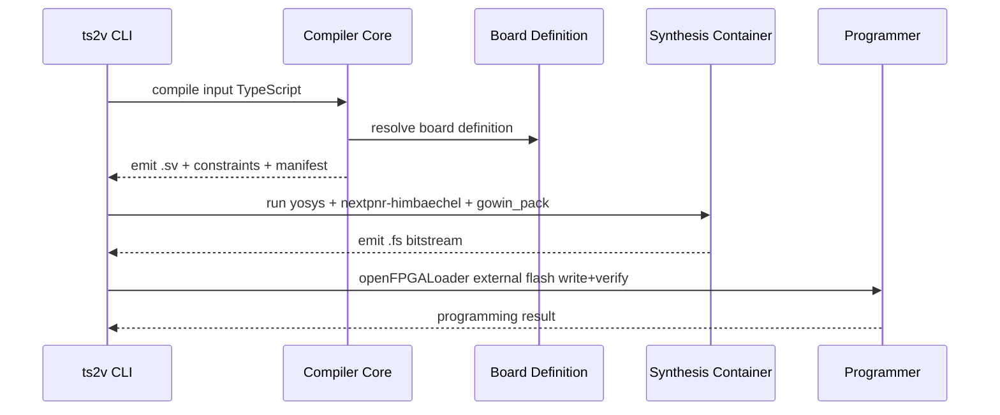

# Hardware Toolchain Guide

This document describes the production hardware pipeline used by this repository.

## Toolchain Stages


## Core Components
- `yosys`: synthesis (`synth_gowin`)
- `nextpnr-himbaechel`: place-and-route
- `gowin_pack`: bitstream generation
- `openFPGALoader`: board programming

## Runtime Model
- Preferred runtime: Podman
- Fallback runtime: Docker
- Runtime/image settings source: `configs/workspace.config.json`

## Build Toolchain Image
```bash
bun run toolchain:image:build
```

## Compile + Flash (Tang Nano 20K)
```bash
bun run apps/cli/src/index.ts compile examples/hardware/tang_nano_20k_blinker.ts \
  --board boards/tang_nano_20k.board.json \
  --out .artifacts/tang20k \
  --flash
```

## Expected Programmer Mode
Default path for Tang Nano 20K is explicit persistent mode:
- `--external-flash --write-flash --verify`

## USB Probe Validation
Always run before concluding flash is broken:
```bash
lsusb
podman run --rm --device /dev/bus/usb ts2v-gowin-oss:latest openFPGALoader --scan-usb
```

## Failure Boundaries
- Compile failures: source/parser/type issues.
- Synthesis/place failures: top module / constraints / device mismatch.
- Flash failures: permissions, probe profile, cable, board mode.
- No visible behavior after successful flash: pin mapping, polarity, board variant mismatch.

## Deep Dive Guides
- `docs/guides/board-definition-authoring.md`
- `docs/guides/tang_nano_20k_programming.md`
- `docs/guides/debugging-and-troubleshooting.md`
- `docs/guides/programmer-profiles-and-usb-permissions.md`

## Reference Links
- Yosys: https://yosyshq.net/yosys/
- nextpnr: https://github.com/YosysHQ/nextpnr
- Apicula/gowin_pack: https://github.com/YosysHQ/apicula
- openFPGALoader: https://github.com/trabucayre/openFPGALoader
