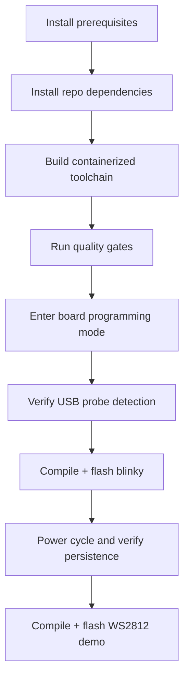

# Quickstart: From Zero To Real FPGA Output

This guide is written for first-time users and assumes you start from a clean Linux machine.

## Goal
By the end of this guide you will:
- install and validate this repository,
- compile and flash a persistent Tang Nano 20K blinky image,
- compile and flash a WS2812 demo image,
- understand how to verify each stage.

## End-to-End Flow


## 1. Prerequisites
Required:
- Linux
- Bun 1.3+
- Podman or Docker
- Git
- Tang Nano 20K board and USB programming connection

Optional but recommended:
- Logic analyzer (for WS2812 signal inspection)
- USB current meter (for LED strip power troubleshooting)

## 2. Clone And Install
```bash
git clone <your-repo-url> ts2v
cd ts2v
bun install
```

## 3. Build Toolchain Image
This builds an image with Yosys, nextpnr-himbaechel, gowin_pack, and openFPGALoader.

```bash
bun run toolchain:image:build
```

## 4. Run Baseline Quality
```bash
bun run quality
```

If this fails, fix workspace issues before touching hardware.

## 5. Prepare Board Programming State
Put the board into programming mode (per board hardware workflow), then confirm host USB sees a programmer.

```bash
lsusb
```

Then confirm container visibility (this is the one that matters for this repo):

```bash
podman run --rm --device /dev/bus/usb ts2v-gowin-oss:latest openFPGALoader --scan-usb
```

If scan output is empty, stop and fix USB permissions/profile detection first.

## 6. Compile And Flash Blinky (Persistent)
```bash
bun run apps/cli/src/index.ts compile examples/hardware/tang_nano_20k_blinker.ts \
  --board boards/tang_nano_20k.board.json \
  --out .artifacts/tang20k \
  --flash
```

Success indicators:
- compile artifacts appear in `.artifacts/tang20k`
- programmer command contains `--external-flash --write-flash --verify`
- programming output includes `write to flash`, `Verifying write`, `DONE`

## 7. Verify Persistence
Power cycle the board. If behavior disappears, treat this as a board boot/pin issue and use `docs/guides/debugging-and-troubleshooting.md`.

## 8. Compile And Flash WS2812 Demo
```bash
bun run apps/cli/src/index.ts compile examples/hardware/tang_nano_20k_ws2812b.ts \
  --board boards/tang_nano_20k.board.json \
  --out .artifacts/ws2812 \
  --flash
```

Important:
- You need a real WS2812 device connected to the board output pin.
- The onboard user LEDs are not a replacement for WS2812 behavior verification.

## 9. What To Check If WS2812 Looks Dead
- Data pin matches board definition (`ws2812` pin in board JSON).
- Shared ground between board and strip.
- Correct supply voltage/current for strip.
- Flash command used persistent external flash mode.

## 10. Next Reads
- Board definitions: `docs/guides/board-definition-authoring.md`
- Tang Nano programming: `docs/guides/tang_nano_20k_programming.md`
- Debugging failures: `docs/guides/debugging-and-troubleshooting.md`
