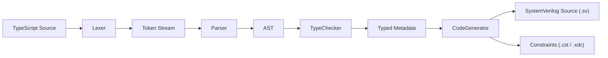

# ts2v Language Specification

## Overview

ts2v compiles a subset of TypeScript into IEEE 1800-2017 SystemVerilog for FPGA deployment.
Two compilation paths are supported:

1. **Functional compiler**: `function` declarations map to combinational `module` blocks.
2. **Class compiler**: `class` declarations with decorators map to sequential/combinational `module` blocks with `always_ff`/`always_comb`.

## Functional Compiler

### TypeScript to SystemVerilog Types

| TypeScript   | SystemVerilog               | Width           |
| ------------ | --------------------------- | --------------- |
| `number`     | `logic [31:0]`              | 32-bit signed   |
| `boolean`    | `logic`                     | 1-bit           |
| `number[N]`  | `logic [31:0] name [0:N-1]` | Array of 32-bit |
| `boolean[N]` | `logic name [0:N-1]`        | Array of 1-bit  |

### Variable Declarations
- `const` and `let` with explicit or inferred type annotation

### Functions to Modules
Each function declaration becomes one Verilog module:
- Parameters: `input logic` ports
- Return value: `output logic` port named `result`
- Local variables: `logic` declarations with `assign` statements

### Operators

| TypeScript                         | SystemVerilog    | Category                                         |
| ---------------------------------- | ---------------- | ------------------------------------------------ |
| `+`, `-`, `*`                      | same             | Arithmetic                                       |
| `&`, `\|`, `^`, `~`                | same             | Bitwise                                          |
| `>>`                               | `>>`             | Logical right shift                              |
| `>>>`                              | `>>>`            | Arithmetic right shift (IEEE 1800-2017 §11.4.10) |
| `<<`                               | `<<`             | Left shift                                       |
| `!`                                | `!`              | Logical NOT                                      |
| `===`, `!==`, `>`, `<`, `>=`, `<=` | `==`, `!=`, etc. | Comparison                                       |

### Control Flow
- `if/else`: emitted as ternary mux chains (combinational assignment)

### Literals
| TypeScript | SystemVerilog | Notes                          |
| ---------- | ------------- | ------------------------------ |
| `42`       | `32'd42`      | Decimal                        |
| `0xFF`     | `32'hFF`      | Hexadecimal                    |
| `0b1010`   | `4'b1010`     | Binary                         |
| `true`     | `1'b1`        | Boolean                        |
| `false`    | `1'b0`        | Boolean                        |
| `10_000`   | `32'd10000`   | Underscore separators stripped |

### Output Format
1. `// Generated by ts2v - TypeScript to SystemVerilog compiler` header
2. `` `timescale 1ns / 1ps ``
3. `` `default_nettype none ``
4. Module definitions (ANSI-style ports, `logic` types)
5. `` `default_nettype wire ``

### Not Supported in Functional Compiler
Classes, interfaces, generics, loops, strings, async/await, imports, sequential logic, clock/reset.

## Class Compiler

### Decorator API

```typescript
class Blinker extends Module {
  @Input  clk: Logic<1>;
  @Input  rst_n: Logic<1>;
  @Output led: Logic<6> = 0;

  @Sequential
  tick() {
    if (!this.rst_n) {
      this.led = 0x3f; // all off (active-low)
    } else {
      this.led = this.led + 1;
    }
  }
}
```

### Supported Decorators
| Decorator        | Description                              |
| ---------------- | ---------------------------------------- |
| `@Input`         | Module input port                        |
| `@Output`        | Module output port with optional default |
| `@Sequential`    | Maps to `always_ff @(posedge clk)`       |
| `@Combinational` | Maps to `always_comb`                    |
| `@Submodule`     | Instantiate a sub-module                 |
| `@Assert`        | Generate concurrent assertion            |

### Port Types
| TypeScript        | SystemVerilog   | Notes                       |
| ----------------- | --------------- | --------------------------- |
| `Logic<N>`        | `logic [N-1:0]` | N-bit signal                |
| `UintN` / `UIntN` | `logic [N-1:0]` | Unsigned N-bit, tested >64b |
| `logic` (bare)    | `logic`         | 1-bit                       |

### Sequential Logic (always_ff)
- Non-blocking assignments `<=` (IEEE 1800-2017 §10.4.2)
- Async active-low reset: `@(posedge clk or negedge rst_n)`
- `if (!this.rst_n)` resets signals to defaults

### Combinational Logic (always_comb)
- Blocking assignments `=` (IEEE 1800-2017 §10.4.1)
- No latches when all outputs are assigned

### Enums as typedef enum
```typescript
enum State { Idle = 0, Active = 1, Done = 2 }
```
Generates:
```systemverilog
typedef enum logic [1:0] { Idle = 2'd0, Active = 2'd1, Done = 2'd2 } State_t;
```

### Method-Local Registers

`let` or `const` declarations inside `@Sequential` or `@Combinational` methods that are **assigned across multiple branches** are promoted to module-level `logic` registers. This allows stateful intermediate computations without requiring explicit `@Output` or port exposure:

```typescript
@Sequential
tick() {
  let bitValue: Logic<1> = 0;   // promoted to module-level logic
  let highTicks: Logic<6> = 0;  // promoted to module-level logic

  if (this.state === 1) {
    bitValue = 1;
    highTicks = T1H;
  } else {
    bitValue = 0;
    highTicks = T0H;
  }
  this.ws2812 = bitValue;
}
```

Generated output:
```systemverilog
logic          bitValue;
logic [5:0]    highTicks;

always_ff @(posedge clk or negedge rst_n) begin
  if (!rst_n) begin
    bitValue  <= 1'b0;
    highTicks <= 6'h00;
  end else begin
    if (state == 1) begin
      bitValue  <= 1'b1;
      highTicks <= T1H;
    end else begin
      bitValue  <= 1'b0;
      highTicks <= T0H;
    end
    ws2812 <= bitValue;
  end
end
```

Local variables declared with `Logic<N>` are promoted to `logic [N-1:0]` module signals. Inferred-width locals default to `logic`.

### Submodule Instantiation
```typescript
@Submodule adder = new Adder({ a: this.x, b: this.y, result: this.sum });
```

## Pipeline Architecture



## Configuration
Layered: `base.config.json`, then board config, then user config (via CLI `--config`).

## Quality Requirements
- All tests pass: `bun run quality`
- Parse errors include line/column location
- Generated SystemVerilog is syntactically and semantically valid
- No hardcoded values in source
- No compiler-imposed cap on bit width or array size
