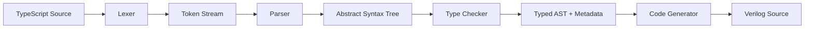

# ts2v Specification: MVP (Milestone 1)

## Overview

A TypeScript-to-Verilog transpiler converting a subset of TypeScript into
synthesizable Verilog HDL for FPGA deployment.

## Supported TypeScript Subset

### Types
- `number` maps to `wire [31:0]` (32-bit signed integer)
- `boolean` maps to `wire` (1-bit)
- `number[N]` maps to `wire [31:0] name [0:N-1]` (fixed-size array)
- `boolean[N]` maps to `wire name [0:N-1]` (fixed-size boolean array)

### Declarations
- `const` with explicit or inferred type annotation
- `let` with explicit or inferred type annotation

### Functions
Each function transpiles to a Verilog module:
- Parameters become `input` ports
- Return value becomes `output` port named `result`
- Local variables become `wire` declarations with `assign` statements

### Operators
All operators translate to their Verilog equivalents:

| TypeScript | Verilog | Category     |
|-----------|---------|--------------|
| `+`       | `+`     | Arithmetic   |
| `-`       | `-`     | Arithmetic   |
| `*`       | `*`     | Arithmetic   |
| `&`       | `&`     | Bitwise      |
| `\|`      | `\|`    | Bitwise      |
| `^`       | `^`     | Bitwise      |
| `~`       | `~`     | Bitwise NOT  |
| `>>`      | `>>`    | Shift        |
| `<<`      | `<<`    | Shift        |
| `===`     | `==`    | Comparison   |
| `!==`     | `!=`    | Comparison   |
| `>`       | `>`     | Comparison   |
| `<`       | `<`     | Comparison   |
| `>=`      | `>=`    | Comparison   |
| `<=`      | `<=`    | Comparison   |

### Control Flow
- `if/else` translates to ternary mux chains (combinational only)
- Chained `if/else if/else` produces nested ternary expressions

### Literals
- Decimal: `42` becomes `32'd42`
- Hexadecimal: `0xFF` becomes `32'hFF`
- Binary: `0b1010` becomes `4'b1010`
- Boolean: `true` becomes `1'b1`, `false` becomes `1'b0`
- Underscores in numbers: `10_000` parsed as `10000`

## NOT in MVP

- Classes, interfaces, generics
- Loops (require sequential logic / FSM generation)
- String type
- Async/await
- Module imports (single file only)
- Sequential logic (always_ff)
- Clock/reset handling

## Pipeline Stages

### Stage 1: Lexer
- Tokenizes source into keywords, identifiers, literals, operators, punctuation
- Tracks line and column for every token
- Skips single-line (`//`) and block (`/* */`) comments
- Supports hex (`0x`), binary (`0b`), and underscore-separated numeric literals

### Stage 2: Parser
- Recursive descent parser with precedence climbing for expressions
- Produces strongly typed AST nodes
- Reports first error with line and column

### Stage 3: Type Checker
- Resolves variable types from declarations
- Checks operator compatibility
- Infers expression result types
- Maps TypeScript types to hardware types
- Detects: undeclared variables, duplicate declarations, const reassignment

### Stage 4: Code Generator
- Each function becomes a Verilog `module`
- Parameters become `input` ports with correct bit widths
- Return becomes `output` port
- Local variables become `wire` declarations with `assign`
- `if/else` becomes ternary operator chains
- Identifiers colliding with Verilog reserved words are suffixed with `_v`

## Verilog Output Format

Every generated file includes:
1. `// Generated by ts2v` header comment
2. `` `timescale 1ns / 1ps `` directive
3. `` `default_nettype none `` before modules
4. Module definitions with ANSI-style ports
5. `` `default_nettype wire `` after modules

## Configuration

The compiler supports layered configuration:
1. **Base config** (`base.config.json`): default values
2. **Board config** (`arty_a7.board.json`): board-specific overrides
3. **User config** (CLI `--config`): final overrides

Each layer merges on top of the previous using shallow section merge.

## Quality Requirements

- All test cases pass
- All parse errors include line and column
- Generated Verilog is syntactically valid
- Test suite covers all supported constructs
- No hardcoded values in source (extracted to constants)
- Max 200 lines per source file
- Explicit naming with units where applicable
